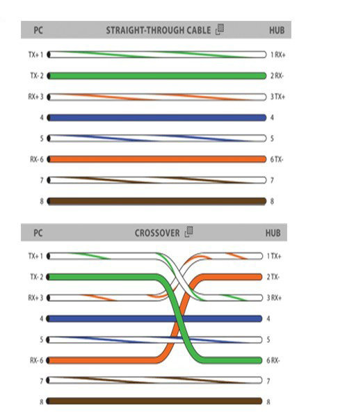
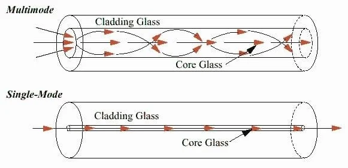

#  Lab day 2

This focus more in network connections focusing in physical conections like, UTP and Single mode and multimode fiber,
also we see the different speeds and distances for each network specification

UTP - Ethernet

| Medium Type | IEEE Spec / Clause                  | Speed    | Max Distance               | Connector | Cable Category | Notes                            |
| ----------- | ----------------------------------- | -------- | -------------------------- | --------- | -------------- | -------------------------------- |
| UTP Copper  | IEEE 802.3 Clause 14 (10BASE-T)     | 10 Mbps  | 100 m                      | RJ-45     | Cat3+          | Early Ethernet over twisted pair |
| UTP Copper  | IEEE 802.3u Clause 25 (100BASE-TX)  | 100 Mbps | 100 m                      | RJ-45     | Cat5e          | Full-duplex supported            |
| UTP Copper  | IEEE 802.3ab Clause 40 (1000BASE-T) | 1 Gbps   | 100 m                      | RJ-45     | Cat5e/Cat6     | Gigabit Ethernet                 |
| UTP Copper  | IEEE 802.3an Clause 55 (10GBASE-T)  | 10 Gbps  | 55 m (Cat6), 100 m (Cat6a) | RJ-45     | Cat6/Cat6a     | High-performance copper          |
| UTP Copper  | IEEE 802.3bq Clause 113 (25GBASE-T) | 25 Gbps  | 30 m                       | RJ-45     | Cat8           | Data center short links          |
| UTP Copper  | IEEE 802.3bq Clause 113 (40GBASE-T) | 40 Gbps  | 30 m                       | RJ-45     | Cat8           | Parallel to 25GBASE-T adoption   |

Multimode Fiber

| Medium Type | IEEE Spec / Clause                     | Speed    | Max Distance (by Fiber Grade)                    | Connector | Fiber Grade | Notes                          |
| ----------- | -------------------------------------- | -------- | ------------------------------------------------ | --------- | ----------- | ------------------------------ |
| MMF         | IEEE 802.3z Clause 38 (1000BASE-SX)    | 1 Gbps   | 220 m (OM1), 550 m (OM2/OM3)                     | LC, SC    | OM1–OM3     | Short wavelength 850 nm        |
| MMF         | IEEE 802.3ae Clause 52 (10GBASE-SR)    | 10 Gbps  | 26 m (OM1), 82 m (OM2), 300 m (OM3), 400 m (OM4) | LC        | OM1–OM4     | Short wavelength 850 nm        |
| MMF         | IEEE 802.3ba Clause 86 (40GBASE-SR4)   | 40 Gbps  | 100 m (OM3), 150 m (OM4)                         | MPO       | OM3/OM4     | Parallel optics (4 × 10 Gbps)  |
| MMF         | IEEE 802.3bm Clause 95 (100GBASE-SR4)  | 100 Gbps | 70 m (OM3), 100 m (OM4)                          | MPO       | OM3/OM4     | Parallel optics (4 × 25 Gbps)  |
| MMF         | IEEE 802.3ba Clause 86 (100GBASE-SR10) | 100 Gbps | 100 m (OM3), 125 m (OM4)                         | MPO       | OM3/OM4     | Parallel optics (10 × 10 Gbps) |

Single mode Fiber

| Medium Type | IEEE Spec / Clause                    | Speed    | Max Distance | Connector | Fiber Grade | Notes                         |
| ----------- | ------------------------------------- | -------- | ------------ | --------- | ----------- | ----------------------------- |
| SMF         | IEEE 802.3z Clause 38 (1000BASE-LX)   | 1 Gbps   | 5 km         | LC, SC    | OS1/OS2     | Long wavelength 1310 nm       |
| SMF         | IEEE 802.3ae Clause 52 (10GBASE-LR)   | 10 Gbps  | 10 km        | LC        | OS1/OS2     | Long wavelength 1310 nm       |
| SMF         | IEEE 802.3ae Clause 52 (10GBASE-ER)   | 10 Gbps  | 40 km        | LC        | OS2         | Extra-long wavelength 1550 nm |
| SMF         | IEEE 802.3ba Clause 88 (40GBASE-LR4)  | 40 Gbps  | 10 km        | MPO, LC   | OS2         | WDM over 4 wavelengths        |
| SMF         | IEEE 802.3ba Clause 88 (100GBASE-LR4) | 100 Gbps | 10 km        | MPO, LC   | OS2         | WDM over 4 wavelengths        |
| SMF         | IEEE 802.3ba Clause 88 (100GBASE-ER4) | 100 Gbps | 40 km        | LC        | OS2         | Long-haul                     |

